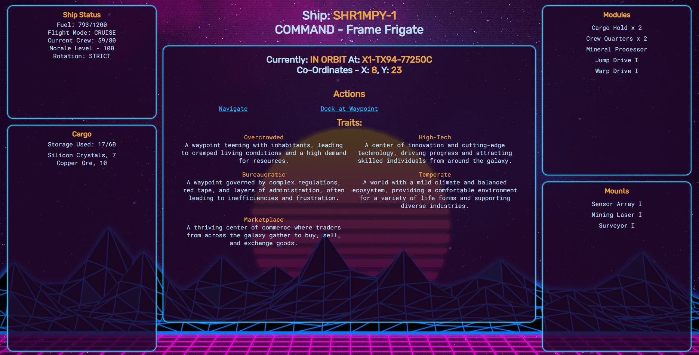
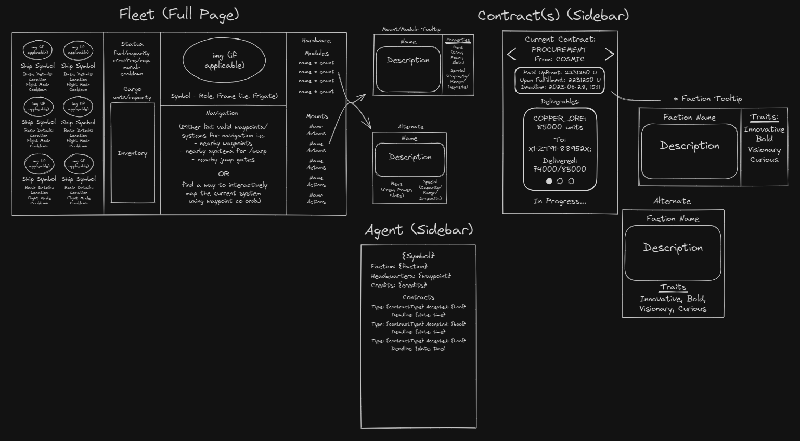
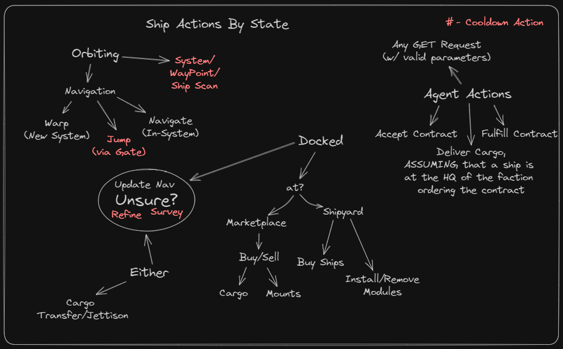

# StarPost (SpaceTraders Client)
A user-friendly app to interact with the [SpaceTraders](https://spacetraders.io/)!
## :computer: [Click here](http://space-trade-starpost.surge.sh) to try it out!
## :page_facing_up: About
- StarPost runs off the back of the SpaceTraders API, meaning you will need to have an "Agent" registered with them to use it.
- On entry, you'll be prompted to enter your authorization token (don't worry, the only place this is stored is on your browser!)
- Once you've filled it in, click "Enter" to see your Agent's details, current contract, and fleet of ships!

## :pencil: Planning & Problem Solving
- * Need to talk a bit about my general plan with this project.
- Add screenshots/drawings of the doodles/plans during the planning phase.

- Flow charts of app logic.

## :floppy_disk: Cool tech
- React & React Router to emulate the look of a multi-page application while keeping it to one page!
- MUI Tooltips to show information on some items on hover!
- Sass (Scss) to make my relationship with styling considerably easier!
## :wrench: Bugs to fix :space_invader:
- When travelling, the app will read the ship as travelling even after arrival until the page is refreshed. Need to set a timer to tell the component to render again on arrival.
- Errors for failed actions are currently only display in the console rather than on-screen, need to implement a modal pop-up to display error messages to the user.
## :bulb: Lessons learnt
Things I learnt during development:
- I definitely had a solid learning curve to get around with React, I've become prety fluent with Hooks & prop drilling throughout this though!
If I had to start this again from scratch I would:
- Look a little closer at the different libraries React has on offer and what I can adapt for my own app.
## :clipboard: Future features
If I were to continue expanding on this as a side project, I would:
- Definitely implement some more actions from the API, time constraints have left it a little light-on.
- Add some features of my own, such as a "Captain's Log" journal or giving users the option to upload their own art for their agent/ships
- Some different backgrounds that could change depending on the currently docked waypoint
